# PR Pubs :: Summer 2016
This is the course resource site for PR Publications, a course at the University of Oklahoma, taught in the Gaylord College of Journalism and Mass Communications.

**Instructor**

Adam Croom 
**Location**: Old Science Hall, Room 224 
**Phone**: (405) 325-2960 
**E-mail**: a.croom (d0t) ou.edu 
**Twitter**: <a href="http://twitter.com/acroom" target="blank">@acroom</a> 
**Office hours**: Please email me if you would like to meet either face-to-face or online!

## Syllabus

Below is the formal syllabus explaining what the course exactly is but these tend to get a little jargony at times which won't be incredibly helpful if there is your first introduction into the course. The short of it is this: This course is _outcomes_ centric and thus you will learn by _doing_. While the first part of the course is focused on understanding design techniques and terminology and is a little more content driven, we will be simply applying this foundational knowledge through different use cases throughout the rest of the semester. The real work are the assignments in which you'll be creating tangible publication pieces. You'll then be putting these works onto your blog where you'll be expected to reflect on your work and give a narrative for your creative process. In the end, you'll have a robust portfolio (so to speak) which won't only be a collection of your final work which potential employers can see, but a collection of your thoughts, struggles, and victories throughout this 8-week experience. In essence, you'll be donning a potentially new hat of "Visual Designer" throughout this exploration. You'll also be a "Digital Storyteller." Terms like "digital," "visual," or "creative" can seem a little scary to some, but that's ok right now. Like a good ride at a theme park, a little bit of nervousness makes the ride much more memorable on the back end. Note that most of you are coming in at the same level: novice. This means you all are your biggest allies. I _want _you to be successful in this course and to do this you will see that I've set up ways in which you can lean on and learn from each other's experiences throughout the course.

### Course Description

Institutional and industrial publications as an important means of internal and external communications with special emphasis on design, layout and content. Laboratory. 
**Prerequisites**: JMC 1013, 2033, 3413, and 3423.

### Course Objectives

Think **critically, creatively and independently**. Recognize how public relations publications differ from other publications in purpose, publics, funding and design. Apply **graphic design concepts** and apply appropriate visual communication theories in the effective use and presentation of images and information. Apply **web design concepts** and apply web communication techniques and theories in the effective use and presentation of images and information online. **Conduct research**, evaluate information and use that knowledge to select appropriate communication channel. Design for a target audience. Distinguish and demonstrate the **use a variety of publication production techniques** and options.

### Course Outcomes

Students will launch and maintain a blog as well as comment on the blogs of their peers. Students will build a foundational knowledge of the landscape of visual communication technologies. Students will design a business card and letterhead for a brand. Students will design a direct mail piece for multiple, specific publics. Students will design a newsletter for an entity. Students will develop a personal portfolio website.

### Course Rationale

This course strives to train students to recognize and apply good publication design techniques in a public relations setting. In addition, students will learn the importance of structuring visual communications for the web. The major goal of the course is to give students the ability to translate a concept of visual communication into an actual publication. Other goals include practice with computer graphics, knowledge of publication techniques and options in print and online, publication production skills and a knowledge of how to work with designers, graphic artists, publication specialists, photographers and commercial printers and web developers to convey their messages to target audiences.

### Assignments / Grading

This course has a mix of Design projects assignments and weekly assignments. Weekly assignments will included course readings, watching tutorial videos, writing blog posts, and comment on other student's blogs. There will be eight (8) quizzes throughout the summer semester and they are worth 20 points. This one is fairly straight forward: you do what is asked and you will complete an online quiz about those assignments. You will self assess how much of the work you did each week through the unit quiz.

There will be four projects throughout the summer semester and they are worth 60 points per project. I grade these against a rubric, which you will get at the beginning of each assignment <a href="https://www.dropbox.com/s/9ge5xskau54ryb5/rubricsample.pdf?dl=0" target="_blank">click here to view a sample rubric</a>. Assignments are expected to be turned in on time. Quizzes are due on Thursdays at noon. I do give a 24-hour grace period for all assignments and will accept work until the following day at noon. Absolutely no assignment will be accepted later than the 24-hour grace period. This is an online class meaning that you have an incredible luxury of being able to work ahead in a lot of cases. My suggestion is to completely take advantage of this and stay ahead of the course schedule. You'll thank me when finals roll around and you've got this class out of the way!

### Grade Mix

**Weekly Quizzes** (32% of final grade) 8 x 10 points Total = 160 points 
**Design Projects (56% of final grade)** 
Business Card and Letterhead Project - 70 points 
Direct Mailer - 70 points 
Social Media - 70 points 
Newsletter - 70 points

**Final Project** (12% of final grade)
Summary of Learning - 60 points **TOTAL POINTS POSSIBLE: 500**

### Grading Scale

A: 450 - 500 points B: 400 - 449 points C: 350 - 399 points D: 300 - 349 points F: 0 - 200 points

### Toolbox

*   **Blog** - As mentioned earlier, one of your assignments will be building and maintaining a personal blog with the platform of your choice. There's more information about how to technically set this up in Week 1.
*   **Course Website** - If you are reading this, you're on the course website! Hooray. Here is where you'll find the majority of course content. Each week has a corresponding module which will tell you what you are expected to do that week. That may include watching videos, reading material, working on a project, a Google Hangout, etc.
*   **Course Hub** - These are where you'll be able to see all the different blog posts from all your peers. This will be helpful in seeing what everyone else is up to. You'll be asked periodically throughout the semester to comment on various posts from other students.
*   **Software** - This course heavily relies on two specific programs for most of the design work you will be doing: Adobe Photoshop and Adobe InDesign. These apps (plus tons of other nice products from Adobe) are <a href="http://www.adobe.com/creativecloud/buy/students.html?sdid=KKTHX&skwcid=AL!3085!3!57438613702!b!!g!!student%20creative%20cloud%20discount&ef_id=U9qj9AAAAPwLracF:20141203035138:s" target="_blank">currently available for $19.99</a> as a product called Creative Cloud Complete. My suggestion is that use this service for the semester. While that is not cheap, it's small price to pay have resume line items such as "Adobe Photoshop." That said, I understand that may be out of reach for some. For those close to campus, one option is to utilize the computers in the Gaylord computer labs as they have fully up-to-date versions of both these programs (**Note: If you are going to use the computer lab, remember that the computer wipes your files every time you log out. Make sure you always carry a flash drive or external hard drive with you!**). For others who don't have the luxury of visiting campus and still don't want to splurge on  Adobe Photoshop, graphic design concepts are completely transferable to other (sometimes free) applications. There are even some great options now that are web or tablet based. I've created a page for free alternatives to both of these programs. You can use these, but please proceed with caution knowing that my knowledge is significantly limited to what these programs offer.

### Gaylord Computer Lab

This course focuses heavily on some paid tools that exist in Adobe Creative Suite. If you are located in Norman, you can access all of these programs for free in the Gaylord Computer labs. Your initial login uses your OU NetID (4x4) as your user name, and “changeme” as your password.  You will be prompted to change your password on your first logon Their Gaylord College network login is distinct from your OU Ozone/email login and only applies to the Gaylord College network. You may not share their login information with anyone.  Doing so may result in their losing access to the network. Please log off when finished using a workstation, but never shut down the computers. Please be courteous of the other students who use these spaces by keeping lids on drinks and by being careful with food. Trash and recycling bins are available in all labs and throughout the College.

#### Lab Hours

**GYLD 2150** 8 a.m. to 5 p.m., Monday through Friday (Closed on Monday July 4th!)

### Special Needs

Students who need special accommodations or have special needs are invited to share these concerns or requests as soon as possible.  Requests for reasonable accommodation should be addressed to the Disability Resource Center, Goddard Health Center, 620 Elm Avenue, Suite 166, (405) 325-3852, TDD (405) 325-4173, Fax (405) 325-4491 or ods@ou.edu.

## FAQ

### How can I be successful online?

#### 1. Set aside scheduled time

One of the hardest things for students to realize is that they are usually spending two and half hours a week in a class room getting a significant amount of work done. Just because this is an online class doesn't translate to the idea that this is less work. Set aside time a couple times a week where you work on this course just like you would class! Stick it in your calendar, make your bosses aware, and keep it like that.

#### 2. Work ahead

My goal is to always have more lessons out there than the person who is the furthest in the class. You have the ability to move faster and you should take advantage of it if you have the extra time or get in a good groove. It's easy to fall behind particularly when you get into the thick of the semester. The beginning of the semester is PRIME for getting ahead in your online courses. While other classes may spending the class time talking through the syllabus and orientation materials, you can be getting a jump start on this one.

#### 3. Know how to ask for help.

Just because this is online doesn't mean I'm not available. Email is the easiest way I promise to promptly return all emails written to me at reasonable hours. If anything needs to be clarified, I'm happy to do so. If there is something we can't solve via email, we can visit in person or through a Google Hangout video chat.

Additionally, I've set up several ways in which you can ask each other! Add it to the forum or put it in a blog post. Check the blogroll for how other students have completed work.

Last, use the Googles! Seriously. Think about this when you are using technology... Technology was created by humans. Humans have questions. There's a 99.9999% chance your question has already been answered. If you can master Google, you will be a much more efficient problem solver.

#### 4. Stay organized

There are several places where you can find due dates. You'll find a calendar in several places on PRPubs.us as well as D2L. You're much more likely to stay on top of the workload if you know the schedule.

#### 5. Get familiar with the course site

It's important that you know the course site inside and out. Almost as important as fully understanding the syllabus! If you're this far down the page you're doing great! Keep reading!

#### 6. Create your own classroom

We don't have a dedicate physical place where this work is done. I suggest you create a false classroom for yourself. Tell yourself "Everything Monday and Wednesday, I'm going to go to the computer lab to do work" or to the library or the coffee. Or make your bedroom extra special. Take your favorite songs at the moment and put it on a Spotify playlist and tell yourself you can only listen to that playlist when you are working on PR Pubs.

#### 7. Really OWN your learning

This one is important throughout your entire collegiate experience, but you feel it a little more in online courses. This course will take a significant amount of self-discipline. This becomes easier when you accept full ownership of your learning. You'll get out of this, what you put into it. Decide now that you WANT to get a lot out of this course. If you own your learning experience, you'll enjoy the time you spend on this course.

### What's a good blog post?

There are several good ways to improve a blog post.

#### 1. Always make sure you add context.

Because blog posts are public, when writing your post you should assume that the reader has no idea what the purpose of your post is for. Therefore, always lead off your posts with some context. It can be brief! Here's an example:

"In my PR Publications course, we are going to be designing a business card and letterhead for an organization of our choice. I chose Big Brothers/Big Sisters as I have volunteered with them since my freshman year. For this assignment, I'm analyzing the state of the current organization's resources, processes, and values overall."

#### 2. Use first person.

Unlike essays, this is your space. Own it.

#### 3. Use images.

Also unlike essays, you can make add images (both still and animated) to your post. Take advantage of this new medium! Some things are better said through images than they are words.

#### 4. Use links.

You can also link to other pages. Did you read an article that helped you work through an assignment? Link to it! Did a classmate post something that was highly interesting? Link to it! Are you referring to a previous post? Li... you get the picture!

#### 5. Give a complete thought.

Rather than focusing on a specific word count, you should focus on giving complete thoughts. Make sure your blog post has a beginning, middle, and end. I'll give you prompts throughout the semester that help you maintain this structure, but stick to it as much as you can.

### How do I get ahold of you?

I'm best reached via email. I do not hold regular office hours but am happy to meet either face-to-face or through a digital medium such as Skype or Google Hangout.

### Where can I find stock images?
* <a href="http://www.freeimages.co" target="_blank">Free Stock Images</a>
* <a href="http://www.stockvault.net" target="_blank">Stock Vault</a>
* <a href="https://stocksnap.io)" target="_blank">Stocksnap</a>
* <a href="http://gratisography.com" target="_blank">Gratisography</a>
* <a href="https://unsplash.com" target="_blank">Unsplash</a>
* <a href="http://images.superfamous.com" target="_blank">Superfamous Images</a>
* <a href="http://nos.twnsnd.co" target="_blank">New Old Stock</a>
* <a href="http://magdeleine.co" target="_blank">Magdeleine</a>
* <a href="http://picography.co" target="_blank">Picography</a>
* <a href="http://isorepublic.com" target="_blank">Isorepublic</a>

### What are some tips for Lynda.com?

Myself, sometimes I get confused with tutorial videos. I'll be moving back and forth through windows on my computer or the person doing the tutorial will simply be talking too fast for me to keep up. I want to give you some tips on how to best grasp these types of videos as I realize they can feel a smidge overwhelming the first time through.

#### 1. Don't be a perfectionist.

Again, remember... Right now it's about the process, not the product. I don't want you to get too bogged down if you can't get something down picture perfect right now. Don't spend endless hours trying to solve the tiniest thing. The point of the exercise right now is for you to make it through this and get a broad overview.

#### 2. Take advantage of the video controls.

Our man for these videos, Justin, is a pretty speedy talker. Luckily, for us, we can manipulate the video so that it actually plays slower (or faster if you would like). You'll see a playback speed controller near the play button at the bottom at each video.

#### 3. Check out the transcript for terms that aren't familiar.

Sometimes you'll hear someone say something that just doesn't sound quite right. Lynda.com provides a scrolling transcript with each video which can be very helpful when you get stuck.

#### 4. Download the exercise files.

Before you get started, the first thing you will want to do is download the Exercise Files for this Lynda.com lesson. You'll see a download button write above the video. Note: This particular file is 621.28 MB (BIG!). Keep this in mind when you are ready to get start that it may take a few minutes for that to download based on your internet speed. If you are having issues getting the file, please let me know via email ASAP. I'm also going to add a friendly reminder that if you are going to use the computer lab, remember that the computer wipes your files every time you log out. Make sure that you always carry a flash drive or external hard drive with you!

Once it's downloaded, unzip the file. You will notice that it contains folders which correspond with specific "chapters."

## Course Blogs

<a href="https://prpubs.us/summer16/" class="btn btn-primary btn-primary" target="_blank">View the Blogs</a>

This will be a place you visit quite often. As you and your fellow students blog about your work, it will get aggregated here, allowing you to see everyone's work. Where most courses are different, in that you work in individual silos, you'll be encouraged in this course to actually learn from each other and not just from me. Given that this course is ultimately based in creativity, this will allow you the opportunity to see how other students have interpreted and reflected the course assignments.

## Week 1

<b>Quiz Due Date</b>: Thursday, May 19, 2016 at noon

### Introduction

Howdy! I'm glad you've made it to the course content area for PR Pubs. You'll see a unit for each week of the course similar to this one. In short, each week you will have some course content as well as assignments that you complete (more below on how that is graded). This week is slightly different as we are just easing into the course, so we are going to be spending the week prepping for the rest of the semester by building our toolkit. One thing to know, there is a LOT of things we want to get started this week. With that, things I want you to do:

### 1. Read the syllabus.

It's above. Please read through and make sure everything about the course is clear. If you have any questions, please email me.

### 2. Build your domain / blog

For this class you are required to maintain a domain and blog, which will become a portfolio by the end of the semester. You can use <a href="https://wordpress.com" target="_blank">Wordpress</a>, <a href="https://www.blogger.com" target="_blank">Blogger</a>, <a href="http://tumblr.com" target="_blank">Tumblr</a>, or <a href="http://create.ou.edu" target="_blank">OU Create</a> (where you could install Wordpress). This choice is totally up to you although there is on campus support for OU Create. Use something you are comfortable with or have a desire to better understand.

### 3. Submit your web address

<iframe src="https://docs.google.com/forms/d/10AiBcyHkrtehSh_m2SzYCKDFzKV4KVqYpDiOr0M0LPA/viewform?embedded=true" width="760" height="500" frameborder="0" marginwidth="0" marginheight="0">Loading...</iframe>

### 4. Write your first post

This activity is designed so that you have a creative way of introducing yourself to the rest of class as well as begin to understand how your blog technically functions. We are going to create a post that I'm going to call a "Professional Portrait." In your blog post, attempt to answer the following questions:

*   Who are you?
*   What do you believe?
*   What do you do?
*   What guides you?
*   What motivates you?
*   Where does design fit in your life? 

You are required to have at least **one picture** in your post and it's preferable that you take it yourself. Taking this with your smartphone or any camera for that matter is fine. If you don't have access to camera and are on campus, cameras are available for checkout in Gaylord.

### 5. Build your technology toolkit

This is touched on heavily about in the syllabus. Go ahead and get Adobe Creative Cloud installed this week. You can also forgo the expense and use the Gaylord labs but it is recommended that you purchase a subscription, even if it's just for this semester.

### 6. What the heck is a PR Publication?

Alright, now that we've got some of the housekeeping out the way. It's time to get into the content of the course.

Let's start with a good ol' definition:** PR publications** provide a free, controlled media designed for publics who share characteristics and interest. Read that definition again. There's a lot there that's worth unpacking.

#### 1. **PR publications** provide a **free**, controlled media designed for publics who share characteristics and interest.

Who pays? How? Why? Organizational funds support public relations publications to improve or maintain positive relationships with target publics. Some accept advertising, but most do not. Some are partially funded by memberships or subscriptions, but many are not. Usually the organization funds the publication as an operating expense. Usually the beneficial relationships resulting from the communication are worth more to the company than the cost of producing or distributing the publication.

#### 2. PR publications provide a free, **controlled media** designed for publics who share characteristics and interest.

Controlled media? What does that mean? **Controlled media** means that the organization controls the message, when it appears, to whom, and how. Most PR publications are distributed directly to the reader either in-person, by mail, or electronically.

#### 3.  PR publications provide a free, controlled media **designed for publics who share characteristics and interest**.

PR Publications work best when you narrow your public. Know everything you can about the target public of each publication. You want to first learn what motivates your public to actually read the publication and to do this will require you to research your publics (which we will do in one of our next lessons).

#### **Types of PR Publications**

*   Identity Symbols (Logotypes, letterheads). **Identity symbols** combine verbal and visual communications to visually represent the organization.
*   Flat publications (Flyers, posters, etc.) **Flat publications** consist of a single sheet of paper, unfolded, and usually printed on one side.
*   Folded publications (Pamphlets brochures, some newsletters) **Folded publications** use folds to create format.
*   Bound publications (Booklets, magazines, annual reports) **Bound publications** are those containing multiple sheets of paper, held together by binding.

### 7. Design Theory and PR Publications

#### Watch these videos and view these slides.

 First things first. Design is design. The theory and principles do not change whether its interior design, fashion, or landscaping because they are all visual communications. What is different is that every design decision is based on information about the publication's purpose, key message, and target public. Design decisions only work when they consider the effect of the design options on the target public. For most of your career as a PR student, you have focused on writing or verbal communication. You know how to structure verbal communications and how words form sentences which for paragraphs, etc. Effectively understanding writing doesn't happen if it doesn't have that structure to support it. Similarly, **visual communication** uses image and patterns to convey messages (as opposed to language with verbal communication). You'll notice up in the upper right hand corner a set of media. This is a collection of what you are required to watch for the unit. The first video is from Lynda.com and is titled "What makes design great?" and the second is called "Exploring the principles of layout and composition." Check that one out first as its very similar to my in-class presentation. My slides for the in class presentation are below.

 <iframe style="border: 1px solid #CCC; border-width: 1px; margin-bottom: 5px; max-width: 100%;" src="https://www.slideshare.net/slideshow/embed_code/key/4zqb4t91QPhDPe" width="427" height="356" frameborder="0" marginwidth="0" marginheight="0" scrolling="no" allowfullscreen="allowfullscreen"></iframe>

<a href="http://www.lynda.com/course/sharerevideodirect/161817/177322?org=ou.edu" target="_blank">What makes design great?</a>

Please watch the Lynda.com video If you aren't familiar with Lynda.com, it's a service that is newly available for free to the OU community (usually $30 a month!). Lynda.com specializes in a lot of technical tutorials and you can learn everything from Photoshop to programming languages like Ruby on Rails. We won't use it a ton, but more as a starting point of references. Of course, you are more than welcome to watch more videos through the course as you see fit.

<a href="https://www.youtube.com/watch?v=3ResTHKVxf4&feature=youtu.be" target="_blank">Ira Glass on Being Creative</a>

Last, you'll find a video from Ira Glass, the host of This American Life. Before we get going too far, I think it's helpful to take a step back and breath again. Remember that creativity and design can be a little hard to grasp at first particularly because your taste is much more refined than your technique. Don't worry about too much about your "products" right now and let's focus on the "process." It's about the _process,_ not the _product_. It's about the _process_, not the _product_. This will slightly change throughout the semester, but, for now, let this be your mantra!

### 8. Complete a design blitz!

Blog Post Required

Through the presentations above, you've learned about several design concepts:

*   Color
*   Typography
*   Metaphors/symbols
*   Minimalism & use of space
*   Form/function/message
*   Balance
*   Rhythm
*   Proportion
*   Dominance
*   Unity

After reading and reviewing the slides, you should be able to provide a basic explanation of each of these concepts. To reinforce your understanding, I want you to undertake a “Design Blitz”. Carry your camera with you this unit and take photos of objects, ads, signs, etc. that illustrate one of these concepts. When you have completed your Design Blitz, **write a blog post** that embeds the photos and your analysis of the design elements and what makes them effective or not. (You can do this in one single post if you like, or in several.) **Provide an example of at least five of the concepts listed above. Make sure to tag your blog post "Design Blitz.** **PRO TIP:** Sometimes we can learn just as much from badly designed things as we can from well-designed things! So feel free to include bad elements as examples to avoid.

### 9. Typography Games

Blog Post Required

Typography is a CRITICAL part of how we tell stories. To practice some of our typography skillz (with a emphasized Z!) we are going to play some typography games. For this assignment, you are to choose three of these font games and play them for a little bit. **Write a short blog post about this experience (don't be afraid to include screenshots!). Tag your blog post "Typography."** Of course, you are more than welcome to play all of them if you want.

1. <a href="http://www.tothepoint.co.uk/more/fun/shoot_the_serif/" target="_blank">Shoot the serif</a>
This is one of my favorites and if I was to say choose one it would be this one. It helps you practice identifying serif vs sans serif fonts.

2. <a href="http://www.typeconnection.com" target="_blank">Type Connection</a>
In this game, you'll choose a font as a main character, give them a story, and then find them a partner or love interest. This is a great game for understanding how fonts can take on certain personality types that you can leverage. Have you ever thought a font looked girly? Or formal? Or hipster? How can you take advantage of that if your brand appeals to audiences with similar characteristics?

3. <a href="http://www.empireonline.com/features/posterletters/" target="_blank">Poster Letters</a>
This is a fun game where you try to guess a movie based off of one letter from the movie title as it appears on its poster. I'll be honest. When I played this game, I expected to do better than I actually did. Bragging rights for the person who gets the most right on this one.

4. <a href="http://typewar.com" target="_blank">Type War</a>
This is a sort of "this or that" game where you look at a letter and decide what font it is. Want to know how to beat this game? Cheat. I'm dead serious. I think this one worth knowing enough that I would actually recommend you open up a word processing application such as Microsoft Word and literally figure it out before you answer. You'll still learn the different looks of fonts and it will get you a little further. If you can make it through all 10 levels of this game and send me a screenshot, I'll throw in some extra points this week.

5. <a href="http://type.method.ac" target="_blank">Kern Type</a>
Instructions (from the website): Your mission is simple: achieve pleasant and readable text by distributing the space between letters. Typographers call this activity _kerning_. Your solution will be compared to a typographer's solution, and you will be given a score depending on how close you nailed it. Good luck!

### 10. Finally, take the quiz!

At the end of each unit you will take a quiz on D2L <a href="learn.ou.edu" target="_blank">learn.ou.edu</a> that is worth a total of 20 points. These exist as a mechanism for you to confirm that you have indeed completed each unit. It isn't actually a "quiz" in the traditional sense of the term. Rather, it's where you tell me that you have indeed completed each portion of the lesson by marking "True" (meaning you did it) or "False" (meaning that you did not do it). Please note: This class, like all the classes at OU, is governed by an Honor Code, which means you must be honest and accurate in the work you do. So, to make sure you are being honest and accurate, read each question differently. When you answer "true," you are taking responsibility for that answer. Wrongly saying you did it, when you indeed did not do it, is a violation of the Honor Code, subject to penalties listed in the <strong><a href="http://onlinecourselady.pbworks.com/w/page/83632159/honorcodeviolations" target="_blank">OU Guide to Academic Integrity</a></strong>.

## Week 2

<b>Quiz Due Date</b>: Thursday, May 26, 2016 at noon

### Introduction

So this is where we start to familiarize with ourselves with the tools we will be using throughout this course. Your main two tools in your toolbox will be using Adobe Photoshop and Adobe InDesign. Now I want to stress that this course isn’t all about using Photoshop and InDesign. It’s really thinking about how we can critically express PR messages through a visual medium. What this means is I’m not going to be giving you lesson after lesson on Photoshop. Rather we’ll be applying the tools to solve problems and create new works. As I mentioned in Lesson 1.2, there is some fundamental knowledge that is worth going through.

For this week we are going to go through roughly two hours of tutorial videos on Lynda.com. The good news is that in several of these you will be following along with the tutorial leader (I believe his name is Justin) and will actually be doing several of the same things he is. If I was to give a recommendation on how to prepare for this, I would say break it up and allot yourself 90 minutes (minimum) for Photoshop and then come back later and doing 90 minutes (minimum) for InDesign.

**Some Lynda.com tips**

I've written a <a href="#what-are-some-tips-for-lyndacom">short answer in the FAQ</a> that I would recommend reading before you get started with Lynda.com. Feel free to check that out.

**Downloading the Lynda.com Exercise files**

Before you get started, the first thing you will want to do is download the Exercise Files for this Lynda.com lesson. You'll see a download button write above the video. Note: This particular file is 621.28 MB (BIG!). Keep this in mind when you are ready to get start that it may take a few minutes for that to download based on your internet speed. If you are having issues getting the file, <strong>please let me know via email ASAP</strong>. I'm also going to add a friendly reminder that if you are going to use the computer lab, remember that the computer wipes your files every time you log out. Make sure that you always carry a flash drive or external hard drive with you!

Once it's downloaded, unzip the file. You will notice that it contains folders which correspond with specific "chapters."

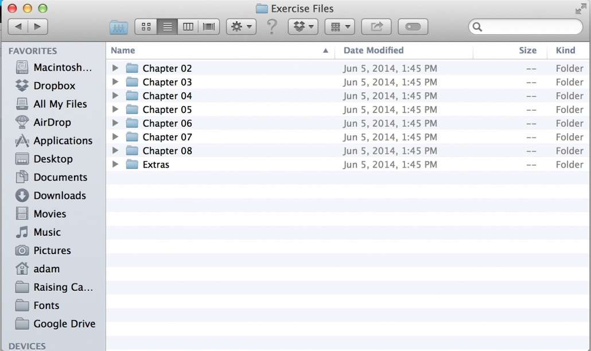

We will using the files inside of Chapter 06 and Chapter 07 for this week.

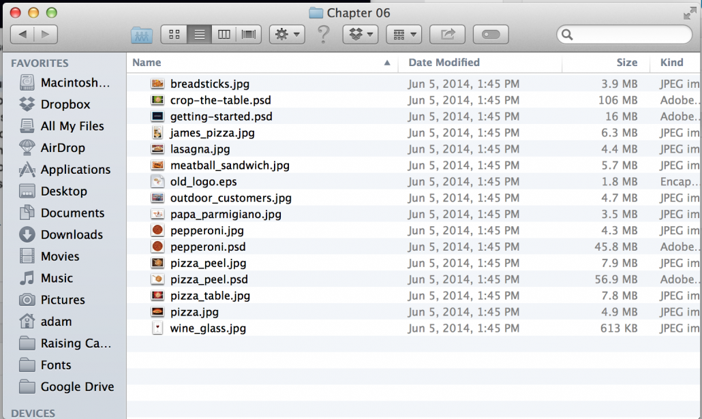

I've provided a couple of screenshots above of what those files should look like. Yours should look the same if you are on a Mac. The files will work either way whether you are on a Windows or Mac computer.

### 1. Understanding Adobe Photoshop

Photoshop is probably the most famous graphic design application that was ever created.Everybody's heard of Photoshop. At it's core, Photoshop is an image manipulation and creation tool. It has a powerful feature set that makes creating and editing pixel-based graphics easier than ever. For this course, you'll get the most out of understanding how to leverage Photoshop to cutout photos, but understand that is a very, very powerful tool.

To better understand Adobe Photoshop, we'll be watching the Chapter 06 videos from "Introduction to Graphic Design" on Lynda.com and you will follow along with the corresponding exercise files. By the time you are done, you should have completely watching the following videos:

<table class="table  table-striped">
<thead>
  <tr>
  <th>Video Name</th>
  <th>Video Link</th>
  </tr>
    <tbody>
      <tr>
      <td>Getting started with Photoshop</td>
      <td><a href="http://www.lynda.com/Illustrator-tutorials/Getting-started-Photoshop/161817/177358-4.html?org=ou.edu" class="btn btn-primary btn-primary" target="_blank">Video</a></td>
      </tr>
      <tr>
      <td>Making selections in Photoshop</td>
      <td><a href="http://www.lynda.com/Illustrator-tutorials/Making-selections-Photoshop/161817/177359-4.html?org=ou.edu" class="btn btn-primary btn-primary" target="_blank">Video</a></td>
      </tr>
      <tr>
      <td>Working with layer masks</td>
      <td><a href="http://www.lynda.com/Illustrator-tutorials/Working-layer-masks/161817/177360-4.html?org=ou.edu" class="btn btn-primary btn-primary" target="_blank">Video</a></td>
      </td>
      </tr>
      <tr>
      <td>Challenge: Masking</td>
      <td><a href="http://www.lynda.com/Illustrator-tutorials/Challenge-Masking/161817/177361-4.html?org=ou.edu" class="btn btn-primary btn-primary" target="_blank">Video</a></td>
      </td>
      </tr>
      <tr>
      <td>Solution: Masking</td>
      <td><a href="http://www.lynda.com/Illustrator-tutorials/Solution-Masking/161817/177362-4.html?org=ou.edu" class="btn btn-primary btn-primary" target="_blank">Video</a></td>
      </td>
      </tr>
      <tr>
      <td>Combining two images together</td>
      <td><a href="http://www.lynda.com/Illustrator-tutorials/Combining-two-images-together/161817/177363-4.html?org=ou.edu" class="btn btn-primary btn-primary" target="_blank">Video</a></td>
      </td>
      </tr>
      <tr>
      <td>Removing unwanted objects from photos</td>
      <td><a href="http://www.lynda.com/Illustrator-tutorials/Removing-unwanted-objects-from-photos/161817/177364-4.html?org=ou.edu" class="btn btn-primary btn-primary" target="_blank">Video</a></td>
      </td>
      </tr>
      <tr>
      <td>Changing the color of photos</td>
      <td><a href="http://www.lynda.com/Illustrator-tutorials/Changing-color-photos/161817/177365-4.html?org=ou.edu" class="btn btn-primary btn-primary" target="_blank">Video</a></td>
      </td>
      </tr>
      <tr>
      <td>Converting images to black and white</td>
      <td><a href="http://www.lynda.com/Illustrator-tutorials/Converting-images-black-white/161817/177366-4.html?org=ou.edu" class="btn btn-primary btn-primary" target="_blank">Video</a></td>
      </td>
      </tr>
      <tr>
      <td>Cropping images nondestructively</td>
      <td><a href="http://www.lynda.com/Illustrator-tutorials/Introduction-Graphic-Design/161817-2.html?org=ou.edu" class="btn btn-primary btn-primary" target="_blank">Video</a></td>
      </td>
      </tr>
      <tr>
      <td>Saving your work for print
      </td>
      <td><a href="http://www.lynda.com/Illustrator-tutorials/Introduction-Graphic-Design/161817-2.html?org=ou.edu" class="btn btn-primary btn-primary" target="_blank">Video</a></td>
      </td>
      </tr>
    </tbody>
</thead>
</table>

### 2. Understanding Adobe InDesign

InDesign is the page layout application that helps you aggregate the work that you've done in Photoshop and combine it with really amazing typographical tools to produce commercial print-ready files, interactive documents, and even tablet-based applications. I like to think of InDesign as sort of the steroid-infused cousin of Microsoft Word. InDesign lends itself really well to producing magazines, brochures, flyers, etc. Since this course focuses on PR Publications, specifically, we'll be spending a lot of time familiarizing ourselves with InDesign.

To better understand Adobe InDesign, we'll be watching the Chapter 07 videos from "Introduction to Graphic Design" on Lynda.com and, similarly to what we did with the Adobe Photoshop tutorials, you will follow along with the corresponding exercise files. By the time you are done, you should have completely watching the following videos:

<table class="table  table-striped">
<thead>
  <tr>
  <th>Video Name</th>
  <th>Video Link</th>
  </tr>
    <tbody>
      <tr>
      <td>Getting started with InDesign</td>
      <td><a href="http://www.lynda.com/Illustrator-tutorials/Introduction-Graphic-Design/161817-2.html?org=ou.edu" class="btn btn-primary btn-primary" target="_blank">Video</a></td>
      </tr>
      <tr>
      <td>Creating a wireframe in InDesign</td>
      <td><a href="http://www.lynda.com/Illustrator-tutorials/Introduction-Graphic-Design/161817-2.html?org=ou.edu" class="btn btn-primary btn-primary" target="_blank">Video</a></td>
      </tr>
      <tr>
      <td>Importing graphics into InDesign</td>
      <td><a href="http://www.lynda.com/Illustrator-tutorials/Introduction-Graphic-Design/161817-2.html?org=ou.edu" class="btn btn-primary btn-primary" target="_blank">Video</a></td>
      </td>
      </tr>
      <tr>
      <td>Adjusting the fit of your graphics</td>
      <td><a href="http://www.lynda.com/Illustrator-tutorials/Introduction-Graphic-Design/161817-2.html?org=ou.edu" class="btn btn-primary btn-primary" target="_blank">Video</a></td>
      </td>
      </tr>
      <tr>
      <td>Creating master pages in InDesign</td>
      <td><a href="http://www.lynda.com/Illustrator-tutorials/Introduction-Graphic-Design/161817-2.html?org=ou.edu" class="btn btn-primary btn-primary" target="_blank">Video</a></td>
      </td>
      </tr>
      <tr>
      <td>Getting your color swatches into InDesign</td>
      <td><a href="http://www.lynda.com/Illustrator-tutorials/Introduction-Graphic-Design/161817-2.html?org=ou.edu" class="btn btn-primary btn-primary" target="_blank">Video</a></td>
      </td>
      </tr>
      <tr>
      <td>Importing text documents into InDesign</td>
      <td><a href="http://www.lynda.com/Illustrator-tutorials/Introduction-Graphic-Design/161817-2.html?org=ou.edu" class="btn btn-primary btn-primary" target="_blank">Video</a></td>
      </td>
      </tr>
      <tr>
      <td>Creating styles in InDesign</td>
      <td><a href="http://www.lynda.com/Illustrator-tutorials/Introduction-Graphic-Design/161817-2.html?org=ou.edu" class="btn btn-primary btn-primary" target="_blank">Video</a></td>
      </td>
      </tr>
      <tr>
      <td>Working with tabs</td>
      <td><a href="http://www.lynda.com/Illustrator-tutorials/Introduction-Graphic-Design/161817-2.html?org=ou.edu" class="btn btn-primary btn-primary" target="_blank">Video</a></td>
      </td>
      </tr>
      <tr>
      <td>Creating tables in InDesign</td>
      <td><a href="http://www.lynda.com/Illustrator-tutorials/Introduction-Graphic-Design/161817-2.html?org=ou.edu" class="btn btn-primary btn-primary" target="_blank">Video</a></td>
      </td>
      </tr>
      <tr>
      <td>Adding the final touches to your design
      </td>
      <td><a href="http://www.lynda.com/Illustrator-tutorials/Introduction-Graphic-Design/161817-2.html?org=ou.edu" class="btn btn-primary btn-primary" target="_blank">Video</a></td>
      </td>
      </tr>
      <tr>
      <td>Creating PDFs in InDesign
      </td>
      <td><a href="http://www.lynda.com/Illustrator-tutorials/Introduction-Graphic-Design/161817-2.html?org=ou.edu" class="btn btn-primary btn-primary" target="_blank">Video</a></td>
      </td>
      </tr>
      <tr>
      <td>Packaging your work for print
      </td>
      <td><a href="http://www.lynda.com/Illustrator-tutorials/Introduction-Graphic-Design/161817-2.html?org=ou.edu" class="btn btn-primary btn-primary" target="_blank">Video</a></td>
      </td>
      </tr>
    </tbody>
</thead>
</table>

### 3. Complete a Newspaper Markup

Blog Post Required

Now that we know more about the tools we will be using, it will be helpful to also know the specific elements of a newsletter or newspaper. These are some key terms worth knowing:
<ul>
	<li>Masthead</li>
	<li>Headlines</li>
	<li>Deck</li>
	<li>Subhead</li>
	<li>Bylines</li>
	<li>Body text</li>
	<li>Photo cutline</li>
	<li>Pull quote</li>
	<li>Dividers</li>
	<li>Jump Line</li>
</ul>
I go over these terms and show you where they correspond on the page in this video below:

<iframe width="560" height="315" src="https://www.youtube.com/embed/gdEgaOzrjLE" frameborder="0" allowfullscreen></iframe>

This short assignment is to grab any newspaper and see if you can locate all of these elements. Take a photo of the marked up newspaper and submit it in a blog post. <strong>Give you blog post the tag "Newspaper Markup"</strong>. Here's an example of a front page that displays all the elements:

### 4. Practice with a Typesetting Assignment

Blog Post Required

Final task for the lesson! We are going to perform a Typesetting assignment where you recreate only the textual portion of the front page of a newsletter. I've provided you with an InDesign document that is already pre-populated with the masthead, images, and logos. You're job is to place the following:
<ul>
	<li>Headlines</li>
	<li>Subheads</li>
	<li>Bylines</li>
	<li>Body text</li>
	<li>Photo cutlines</li>
	<li>Pull quotes</li>
	<li>Dividers</li>
	<li>Jump Line</li>
</ul>
You can download the necessary files by clicking the big button below:

<a href="https://www.dropbox.com/s/joufn2cy8o21sva/TypesettingAssignment.zip?dl=0" class="btn btn-primary btn-default" target="_blank">Assignment Files</a>

<iframe width="420" height="315" src="https://www.youtube.com/embed/tnALQTucEzU" frameborder="0" allowfullscreen></iframe>

If you need some extra guidance in how to lay text, refer to the Typesetting video above.

When you are complete, Export your InDesign document as a PDF and post a link to it on your blog. <strong>Tag your blog post "Typesetting Assignment"</strong>

### 5. Write a blog post reflecting on the week

Blog Post Required

Whew. You've made it! 'It's now time to write a post reflecting on what this week was like. Here's a template for a thorough blog post:

1. What were you asked to do?

2. How did you respond to what you were asked to do?

3. How did react to what you actually <em>did</em>?

4. Now go one level deeper: Why do you think your reaction was what it was?

Feel free to include images in your post if they help you convey what you are trying to say. Then <strong>tag your blog post "Reflection</strong>."

### 6. Take the quiz

Once you've completed the assignments and activities above, you need to complete the quiz on D2L.

## Week 3

### Introduction

<b>Quiz Due Date</b>: Thursday, June 3, 2016 at noon

<b>Project Due Date</b>: Thursday, June 3, 2016 at noon

Week 3 begins our very first design project, which is to design a business card and letterhead. This design project is due <strong>Thursday, June 3, 2016 at noon</strong>. This week we will be focusing on our first piece, the business card. Over the media attachments, you will notice an extra <a href="http://youtu.be/QXNpxlPiCbA" target="_blank">video on InDesign</a>. This is just a quick refresher in case you've forgotten anything over the last couple of weeks. I walk through the following:
<ul>
	<li><a href="http://youtu.be/QXNpxlPiCbA" target="_blank">Drawing Shapes</a></li>
	<li><a href="http://youtu.be/QXNpxlPiCbA?t=4m52s" target="_blank">Placing an Image</a></li>
	<li><a href="http://youtu.be/QXNpxlPiCbA?t=6m58s" target="_blank">Fit Content Proportionally</a></li>
	<li><a href="http://youtu.be/QXNpxlPiCbA?t=7m47s" target="_blank">Scale Tool</a></li>
	<li><a href="http://youtu.be/QXNpxlPiCbA?t=8m51s" target="_blank">Clipping Path</a></li>
	<li><a href="http://youtu.be/QXNpxlPiCbA?t=9m59s" target="_blank">Effects Panel</a></li>
	<li><a href="http://youtu.be/QXNpxlPiCbA?t=12m46s" target="_blank">Typesetting</a></li>
</ul>
As mentioned in Week 2, the way to be most effective with PR publications is to understand your public, so we are going to also walk through how to effectively complete design research.

#### Some tips on business cards:
<strong>1. Consider your essential text content.</strong>

Every business needs your name, your job title, and some form of contact information. The appropriate contact information can vary based on your organization. At minimum, you want to include a phone number and an email address. If your organization is strictly online or you want to drive traffic to the website, make sure to include the website URL. If you have a physical location, an address is most likely necessary. If your organization is very socially conscious or holds their mission in high regard, maybe consider putting the mission statement on the back of the card.

<strong>2. Legibility is key.</strong>

If you can't read the text on a business card, it is essentially useless. Make sure your font isn't too small. The best way to check for too small of font is to print your document out and actually look at it. Also make sure that your contrast is high. If you are using a dark background color, make the text white or light (and vice versa).

<strong>3. Keep your art simple.</strong>

Remember, business cards are fairly small so detailed images won't be very legible. This isn't the type of piece for a photo collage. Stick with your company logo and your organizations primary colors.

### 1. Pick an organization and locate their logo

You will choose an organization for your assignment. It would serve you well to design for an organization you have an interest in. If you want to pursue event planning when you graduate, choose an organization that has a major event and design around that event. If you want to pursue corporate communications, choose an organization that is in need of or has an internal awareness campaign, and design around that. If you aren’t sure what you want to do when you graduate, choose an organization that you are interested in. If you love working with your fraternity or sorority, choose your sorority and identify its campaign need.  You may want to choose an organization that you will be able to develop a personal relationship with, as you may need assistance from the organization in the form of assets and information. It is best if you choose an organization that can be aware of your work for this class. You may choose an organization that already has public relations material, however, if you do, you will perform a redesign and develop new materials in a new design style.

### 2. Locate the organization logo

Once you have decided on an organization, you will need to locate their logo. If this is a local organization, my best advice is to email them and ask for a "high resolution or print ready" version of their logo. Usually, these will be a .eps file or a large size .pdf. It is also okay to use a large .jpg if that is all the company has. <strong>Do not just steal an image of Facebook</strong>. I've had several students attempt to do this before. Facebook compresses the image for screens meaning that it is no longer print ready.

### 3. Research: The Analysis-Synthesis Bridge Model

I want us to examine the Analysis-Synthesis Bridge model, which is a design methodology developed by Dubberly Design to communicate how their designers identity the organizations needs and move that into action to the final product. It consists of a 2x2 quadrant that looks like this:

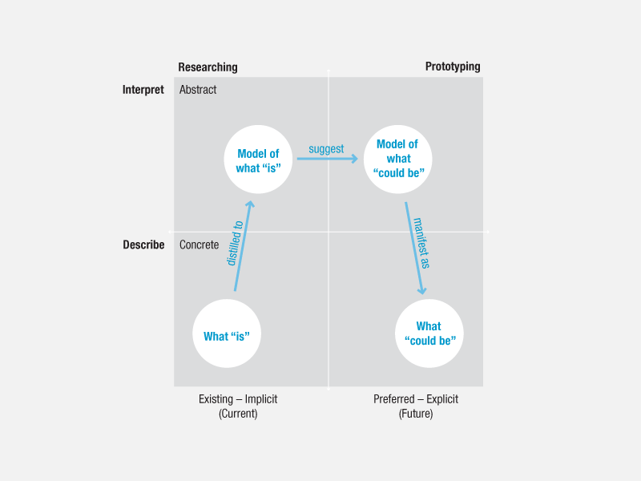
<small>Source: <a href="http://www.dubberly.com/articles/interactions-the-analysis-synthesis-bridge-model.html" target="_blank">http://www.dubberly.com/articles/interactions-the-analysis-synthesis-bridge-model.html</a></small>

You'll notice that the process begins in the lower left quadrant where the designer states what we explicitly know about the organization. Moving to the upper lefthand quadrant, you begin to answer more abstract questions that aren't as concrete. As we move to the upper right hand corner, we start to interpret how we can leverage what we know to propel our design. The lower right hand quadrant is where the design begins to prototype the idea. Let's examine how we may use this for in researching for our PR Publications.

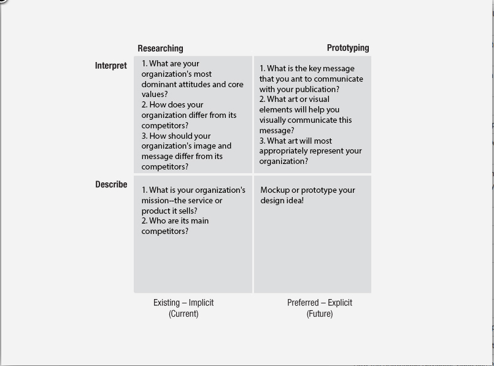

### 4. Analyzing your organization

Blog Post Required

For this blog post we are going to focus on the majority of the questions on this post.

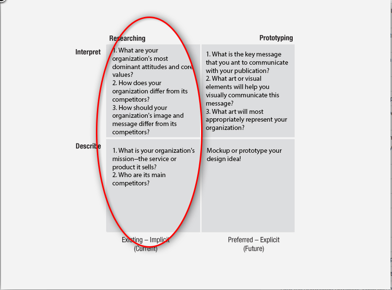

Write a post that address the following questions:
<ol>
	<li>What is your organization's mission--the service or product it sells?</li>
	<li>Who are its main competitors?</li>
	<li>What are your organization's most dominant attitudes and core values?</li>
</ol>
<strong>Tag the post "Research."</strong>

### 5. Competitor Analysis: Create a Pinterest Board

We are now focusing solely on the upper left hand corner quadrant.

For this part of the lesson, we want to conduct a competitor analysis on an organization similar to our own. It's even better if they have a visual strategy that you admire.

#### How to Create a Pinterest Board
**1. Create a Pinterest Account at <a href="http://pinterest.com" target="_blank">pinterest.com</a>**
**2. Create a Board**
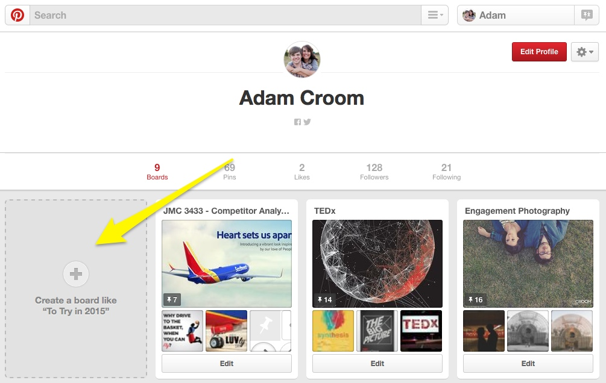

When creating your board, give it a relevant name to the project such as "JMC 3433 - Competitor Analysis." Also be sure that it is a PUBLIC board as we will be posting links to this board on our blog.

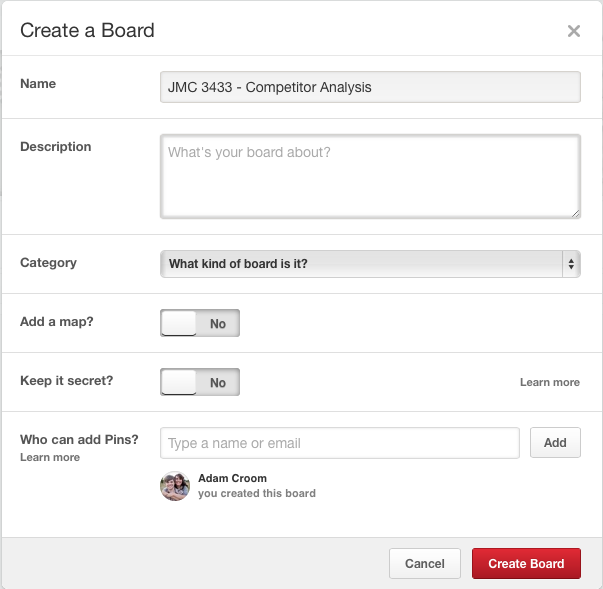

**3. Add a pin**

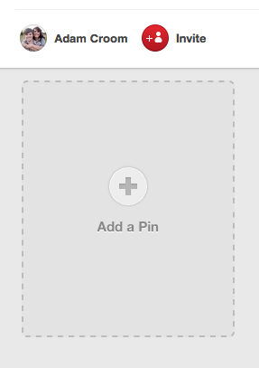

Once the board is created, we want to create pins. You have the ability to either add images from the web or images from your computer.

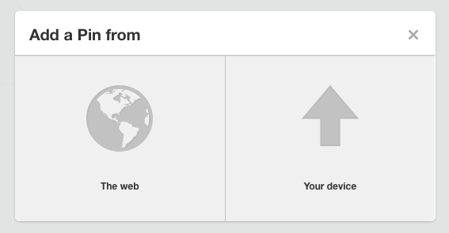

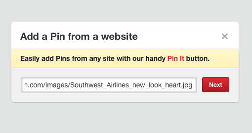

Once you have uploaded the image, pick the board you want the image to go in and add a short description about the image. It's helpful if the description is relevant to class!

Your final Pinterest board should look something like this:

### 6. Competitor Analysis: Blog Post

Blog Post Required

Create a new blog post where you will:
<ol>
	<li>Answer the following questions:
<ol>
	<li>How does your organization differ from its competitors?</li>
	<li>How should your organization's image and message differ from its competitors?</li>
</ol>
</li>
	<li>Add a link to your Competitor Analysis Pinterest Board. You will find it in the address bar of your browser:</li>
</ol>

<strong> Tag the blog post "Research."</strong>

### 7. Build a Communications Strategy

Blog Post Required

Moving on in our hike across the Analysis-Synthesis Bridge Model, we are going to now move to the upper right hand quadrant.

Create a new blog post. For this blog post, I want you to try to "destructure" what you know about writing so far. Have you taken off your super professional writer hat? Good. Now, put on your brainstorming hat. With this post, you have permission to be brief and sloppy! I want you to really ideate and write as many ideas down as you consider the following questions: What kind of visual language will you use? Will the visuals be type or image driven? What do the type and images need to mean? What connotations do they need to have? As you make your way these questions, begin to visualize your business card, what it looks like, and the message it sends when someone hands it out.

### 8. Inspiration and Mood Boards

Now that we are Pinterest pros, we are going to use the same technique to think about our own pieces. We are going to create two separate boards with different purposes:
<ol>
	<li><strong>Create a Pinterest Inspiration Board</strong> - For this board, you want to show examples of other campaign designs that you will draw inspiration from. I've created an example board which you can <a href="http://www.pinterest.com/acroom/letterhead-inspiration-jmc3433-004/" target="_blank">view here</a>.</li>
	<li><strong>Create a Pinterest Mood Board</strong> - Next we are going to create a Pinterest mood board. A mood board is a series of photographs or designs that embody the visual spirit of your proposed design. You can check out some <a href="http://www.pinterest.com/mindbolt/inspiring-mood-boards/" target="_blank">great mood boards examples here</a>.</li>
</ol>
Once you have completed those, add the links to your Pinterest boards in your previous Communications Strategy post that you wrote or simply create a new post.

### 9. Begin your design: Setup your InDesign document

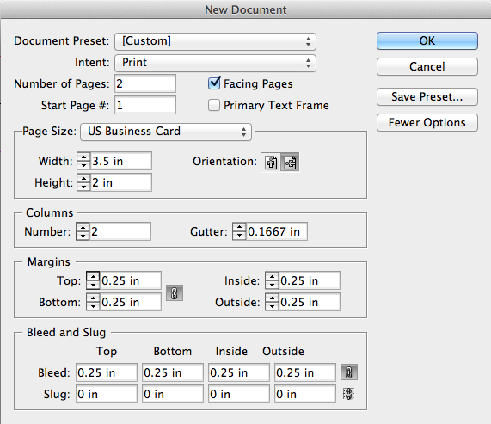

Your document will look like this:

The black border is where the business card would be cut if it is sent to the printer. The red indicates that we have set up a .25" bleed. Make sure to extend your background color to the red. The pink/purple box are our margins. Keep all important information (logo, text) within this space for safety!

<strong>3. Save, save, save your document. Then save again.</strong>

It is utmost importance that you save your work early and often. Save the file as an INDD. If you are not using your own computer, save it onto a thumb drive or external hard drive. Be sure to do the same thing with any other files that correspond with the publication (images, fonts, etc.).

<strong>4. Get to work!</strong>

Time to put all of your time from last weeks tutorials to work. Start by placing your logo and dropping in some of your important text.

### 10. Design your letterhead

For this assignment, you are being asked to design a business card and a paired letterhead. You want your letterhead to have a very similar look and feel to the brand design you create for the business card.

In your letterhead's text, I want you to write a letter from someone at the company so that you can show what text looks like on the page. This could be a Letter from the CEO thanking a donor, an internal memo, etc. The letterhead to be 8.5 in. x 11 in. The number of columns, margins, and bleed is up to you. Below is a screenshot of a dialogue box and of my recommendation for how you should set it up:

### 11. Write a reflection post

Blog Post Required

I want you to reflect on the whole process of your first design project. You accomplished a lot! You've researched a company or organization that you chose, revised drafts, and gave/received feedback. Not bad, eh? I've included below some questions for reflection posts as well as some supplemental questions that you are more than welcome to answer:

1. What were you asked to do?

2. How did you respond to what you were asked to do?

3. How did react to what you actually <em>did</em>?

4. Now go one level deeper: Why do you think your reaction was what it was?

Supplemental questions:
<ul>
	<li>Any long term goals for this design? Do you have any interest in actually pitching this to the organization?</li>
	<li>Do you or do you not feel yourself becoming more confident with the tools you are being asked to used?</li>
	<li>Is there anything you would do differently if you were to start over?</li>
	<li>Do you have any recommendations for future students doing this project?</li>
</ul>
<strong>Tag your blog post "Reflection." Make sure you embed both of your final products!</strong>

### 12. Take the quiz

The quiz is due Thursday, June 3, 2016.

### 13. Turn in work to the Dropbox

The submission needs to be turned in by Thursday, June 3, 2016. You will need to turn in exported PDFs of both documents. If you don't remember how to export to a PDF, please re-watch the <a href="http://www.lynda.com/Illustrator-tutorials/Introduction-Graphic-Design/161817-2.html?org=ou.edu" target="_blank">Lynda video on creating PDFs</a>.

## Week 4

<b>Quiz Due Date</b>: Thursday, June 2, 2016 at noon

### Introduction

<strong>For this next design project, you are only allowed to use Adobe Photoshop</strong>. Since we've spent a fair amount of time bonding with InDesign, Photoshop has felt a little lonesome. It's time to give PS some love.

This week brings Design Project #2, where you will designing two direct mailers for two separate separate stakeholders. <strong>Design Project #2 is due June 2, 2016</strong>. Deliverables for Design Project #2 are as followed:
<ul>
	<li>One completed segmentation matrix</li>
	<li>Two separate mailers turned in as JPGs (front and back for both)</li>
</ul>

We will be analyzing these two separate stakeholders through completing a segmentation matrix.  Similar to the first project, an excellent final product will be one where you can demonstrate proficiency in creating the full print product, where the design clearly ties to the stakeholder, it's not cluttered, it has excellent readability, and where you have effective use of contrast, proximity, alignment &amp; repetition. <strong>Make sure your direct mailer also has a clear call to action for the recipient</strong>. To get clear information on how this assignment will be graded, you'll find a grading rubric attached to the right.

Through the segmentation matrix, you will want to demonstrate clear knowledge of how to prioritize stakeholders by attributes, situation, and communication strategy. Additionally it needs to demonstrate clear knowledge of stakeholder by generation, life stage, social class, lifestyle, gender, and race/nationality. The document must be typed.

### 1. Understand the client and assignment

The client who you will be designing for is OU Recruitment Services. OU Recruitment Services strives to recruit highly qualified direct from high school and transfer students to the University of Oklahoma. Recruitment Services mission is to provide services that will help any student find post-secondary educational opportunities.  These services include, but are not limited to, helping prospective students make educated decisions through the admission, housing, scholarship, and financial aid processes.

Your objective is to create two direct mailers for OU Recruitment Services that are directed at two different stakeholders. Knowing that OU Recruitment Services aim is to recruit new students, you'll want to be thinking about who are stakeholders that could influence a decision like that?

As mentioned above, every direct mailer needs a specific call to action. The call to action is up to you, and should be based upon the knowledge you gather about your stakeholder.

### 2. Understanding publics and stakeholders

One of the most important steps in strategic and effective public relations is accurately identifying the publics with which you want to build mutually beneficial relationships. A popular axiom for public relations is that there is no such thing as a “general public.” In other words, an organization has a variety of key groups who bring different expectations for their relationship with the organization. These differences help an organization segment its publics into groups with similar values and expectations and to focus communication strategies.

Attached, you'll find a short chapter you need to read that is titled "Identifying Stakeholders and Prioritizing Stakeholders and Publics." This is going to be critical information that is required for completing your segmentation matrix. You can prioritize them three different ways:

#### By Attributes
<ul>
	<li><strong>Definitive Stakeholders</strong> - An expectant stakeholder who gains the relevant missing attribute. Often dominant stakeholders with an urgent issue, or dependent groups with powerful legal support. Finally those classed as dangerous could gain legitimacy e.g. democratic legitimacy achieved by a nationalist party.</li>
	<li><strong>Dominant Stakeholders</strong> - The group that many theories position as the only stakeholders of an organisation or project. Likely to have a formal mechanism in place acknowledging the relationship with the organisation or project e.g. Boards of directors, HR department, public relations.</li>
	<li><strong>Dependent Stakeholders</strong> – Stakeholders who are dependent on others to carry out their will, because they lack the power to enforce their stake. For example local residents &amp; animals impacted by the BP oil spill. Advocacy of their interests by dominant stakeholders can make them definitive stakeholders.</li>
	<li><strong>Dangerous Stakeholders</strong> – Those with powerful and urgent claims will be coercive and possibly violent. For example employee sabotage or coercive/unlawful tactics used by activists. Note that Mitchell et al. identify these stakeholders, but don't require them to be acknowledged &amp; thus awarded legitimacy (ibid, p.878).</li>
	<li><strong>Dormant Stakeholders</strong> - Possess power to impose their will through coercive, utilitarian or symbolic means, but have little or no interaction /involvement as they lack legitimacy or urgency.
<strong>Discretionary Stakeholders</strong> - Likely to recipients of corporate philanthropy. No pressure on managers to engage with this group, but they may choose to do so. Examples are beneficiaries of charity.
<strong>Demanding Stakeholders</strong> - Those with urgent claims, but no legitimacy or power. Irritants for management, but not worth considering. Examples are people with unjustified grudges, serial complainers or low return customers.</li>
</ul>
<small><a href="http://www.stakeholdermap.com/stakeholder-analysis/stakeholder-salience.html">Source</a></small>
#### By Situation
<ul>
	<li><strong>Active publics</strong>. This group is highly involved and actively seek information and act on that information.</li>
	<li><strong>Aware publics.</strong> This group will process information and might act, but are limited by lower levels of involvement and problem recognition, or higher levels of constraint recognition</li>
	<li><strong>Aroused publics.</strong> This group has low levels of knowledge, but recognize a potential problem or issue. As their level of involvement is heightened, and they are more likely to begin seeking information.</li>
	<li><strong>Inactive publics. </strong>Inactive as groups of individuals with low levels of knowledge and involvement regarding an organization and its operation</li>
</ul>

#### By Communication Strategy
<ul>
	<li><strong><a class="glossterm">Advocate stakeholders</a>.</strong> This is the group that you want involved in supportive actions such as third-party endorsements, letter-writing campaigns, donations, investments, and attendance at functions. Communication should be action and behavior oriented.</li>
	<li><strong><a class="glossterm">Dormant stakeholders</a></strong>. This is a group that is not ready to be involved. If inactivity is due to lack of knowledge, messages should focus on creating awareness and understanding of the issues that affect them. If the publics are aroused, but not active, then communication should address potential causes of apathy by reducing perceptions of constraints or using affective cues to increase emotional attachment.</li>
	<li><strong><a class="glossterm">Adversarial stakeholders</a></strong>. The initial response to this group is to be defensive. However, defensive communication will not work on this group, it will only entrench them in their position. Defensive communication is better intended for aroused publics who have not decided whether they are supportive or not. Instead, organizations should use conflict resolution strategies that involve nonsupportive stakeholders to seek win-win solutions.</li>
	<li><strong><a class="glossterm">Apathetic stakeholders</a></strong>. Again, the gut reaction to this group is to ignore it. But if this group faces an issue but is not aware of it or does not see its resonance yet, it may still move to an aroused, then aware, and then active public. A better strategy is to increase awareness of the issue with an invitation to collaborate with the organization on the issue before it becomes a problem or crisis. Since it would be difficult to get this group involved, most of the communication effort should be focused on increasing the salience of the issue and invitations for involvement.</li>
</ul>
<small>From “Identifying and Prioritizing Stakeholders and Publics”, chapter 7 from the book <a href="http://2012books.lardbucket.org/books/public-relations/index.html">Public Relations</a> (v. 1.0). Licensed under a <a class="nolink" href="http://creativecommons.org/" target="_blank" rel="cc:attributionURL">Creative Commons</a> <a href="http://creativecommons.org/licenses/by-nc-sa/3.0/" target="_blank" rel="license">by-nc-sa 3.0</a> license.</small>

### 3. Define your stakeholder

Blog Post Required

It will be your choice to decide who to direct their mailers towards. One obvious stakeholder is the prospective student, but there can be several influencers on the decision to attend an institution. To better target the stakeholder, you'll want to be more specific about who that student actually is. Rural / urban? 18 years old or a transfer student? Are their parents alumni? Do they attend sporting events? ACT score? Household income? <strong>Come up with a statement that pinpoints the stakeholder</strong>. Examples are below:
<ul>
	<li>17-19 years of age, ACT/SAT accepted scores, Income: $90,000</li>
	<li>North American Females (17-23 years old) who have already been accepted to OU</li>
	<li>Entry level employees and recent graduates (21-30, avg. age of 23)</li>
	<li>High school seniors who are National Merit Scholars that are trying to choose a school. (17-18 yo)</li>
</ul>
You can see with how with these different publics, that you would want to target different messages. For someone with the ACT score to qualify at you, you may be encouraging them to apply. For a female that has been accepted, you may be inviting them to join an on campus organization. For someone who already who has already graduated, you may be targeting them for grad school. You could come up with hundreds of different individuals, at different stages of the recruitment experience, that would require different messages.

Once you've defined your stakeholder, you'll want to <strong>write a short blog post</strong> brainstorming who this stakeholder is and what messages one might be directing towards them. <strong>Tag your post Stakeholder</strong>.

### 4. Complete the Segmenting Stakeholders matrix

Attached to this page, you'll find a word document which needs to be completed for a stakeholder. Now that you have information on how to prioritize stakeholders, you'll want to apply that to the stakeholder you defined earlier. In the stakeholder matrix, you will prioritize them by attributes, situation, and communication strategy.

<a href="https://www.dropbox.com/s/cu0yfbho5yge4b0/Segmenting20Stakeholders20Matrix.docx?dl=0" class="btn btn-lg btn-primary">Download the Segmenting Stakeholders Matrix</a>

Once that is complete, you'll begin to attempt to understand the stakeholders. I've also attached several documents that will assist you with that portion of the matrix. These include the documents titled:
<ul>
	<li>VALS</li>
	<li>Generation Segmentation</li>
	<li>Life Stages</li>
	<li>Social Class</li>
</ul>
Last, I've included a sample completed matrix. While this assignment may feel time consuming, it will help you understand the values and expectations of your stakeholder and focus your communication strategies.

<a href="https://www.dropbox.com/s/cr2qpzhibrk0bto/gamermatrix-2-2.docx?dl=0" class="btn btn-lg btn-primary">Download the Sample Segmenting Stakeholders Matrix</a>

### 5. Draft your first direct mailer

Below you will find a screenshot of the dialogue box for a new Photoshop document.

Remember: One difference between Photoshop and InDesign is that Photoshop creates a single image whereas InDesign allows you to create document packages. Because of this, you will want to do this process TWICE so that you have one document that is the front and one that is the back.

You'll also want to save two files types: a PSD and a JPG. A native PSD file allows you to manipulate the photo afterwards and the JPG will flatten the image for print. For more information on Photoshop file formats, click the button below which takes you to the Wiki article.

<a href="http://prpubs.us/wiki/Adobe_Photoshop#Common_File_Formats" class="btn btn-primary btn-primary">More Info on Photoshop File Formats</a>

### 6. Define your second stakeholder

Blog Post Required

Now that you've defined your first stakeholder you want to design a direct mailer towards a second stakeholder. Though it's not required, it's preferred that you stakeholder has some level of influence on your first stakeholder. This could be a parent, a relative who is an alum, a friend of the stakeholder, someone in a similar geographical area, etc. Write a blog post defining who this second stakeholder is and tag the post <strong>Stakeholder</strong>.

### 7. Complete the Segmenting Stakeholders Matrix (optional)

This is NOT required this week, but I do want you to do it if you want to complete the exercise again in order to start to generate ideas about how you can specifically target your next stakeholder. Feel free to also do the research methods of the previous assignments as well, such as the the Analysis-Synthesis Bridge model or creating a Pinterest Board. A download button is below for a blank matrix if you so desire to go that route.

<a href="https://www.dropbox.com/s/o8hhqa8ewblmudd/SegmentingStakeholdersMatrix.docx?dl=0" class="btn btn-primary btn-primary">Download the Matrix</a>

### 8. Draft your second direct mailer

Below you will find a screenshot of the dialogue box for a new Photoshop document.  Keep it mind that you will want to do this process TWICE so that you have one document that is the front and one that is the back. You'll also want to save two files types: a PSD and a JPG. A native PSD file allows you to manipulate the photo afterwards and the JPG will flatten the image for print. For more information on Photoshop file formats, click the button below which takes you to the Wiki article.

<a href="http://prpubs.us/wiki/Adobe_Photoshop#Common_File_Formats" class="btn btn-primary btn-primary">More Info on Photoshop File Formats</a>

### 9. Write your reflection post

I want you to reflect on the whole process of your second design project. You accomplished a lot! I've included below the usual questions for reflection posts as well as some supplemental questions that you are more than welcome to answer:

1. What were you asked to do?

2. How did you respond to what you were asked to do?

3. How did react to what you actually <em>did</em>?

4. Now go one level deeper: Why do you think your reaction was what it was?

Supplemental questions:
<ul>
	<li>Do you or do you not feel yourself becoming more confident with the tools you are being asked to used?</li>
	<li>What are some differences you found between Photoshop and InDesign? Do you feel like you prefer either one?</li>
	<li>Is there anything you would do differently if you were to start over?</li>
</ul>
<strong>Tag your blog post "Reflection."</strong>

### 10. Take the quiz

The quiz is due Thurs. June 2, 2016 at noon.

### 11. Turn in both direct mailers into the D2L Dropbox.

The submission needs to be turned in by Thurs., June 2, 2016. You will need to turn in four total saved JPGs (1. front and 2. back of first direct mailer and 3. front and 4. back of the second direct mailer). If you don't remember how to save as a JPG, please re-watch the Lynda.com video below:

<a href="http://www.lynda.com/Illustrator-tutorials/Introduction-Graphic-Design/161817-2.html?org=ou.edu" class="btn btn-primary btn-primary" target="_blank">Video</a>

## Week 5

Coming Soon!

## Week 6

Coming Soon!

## Week 7

Coming Soon!

## Week 8

Coming Soon!
